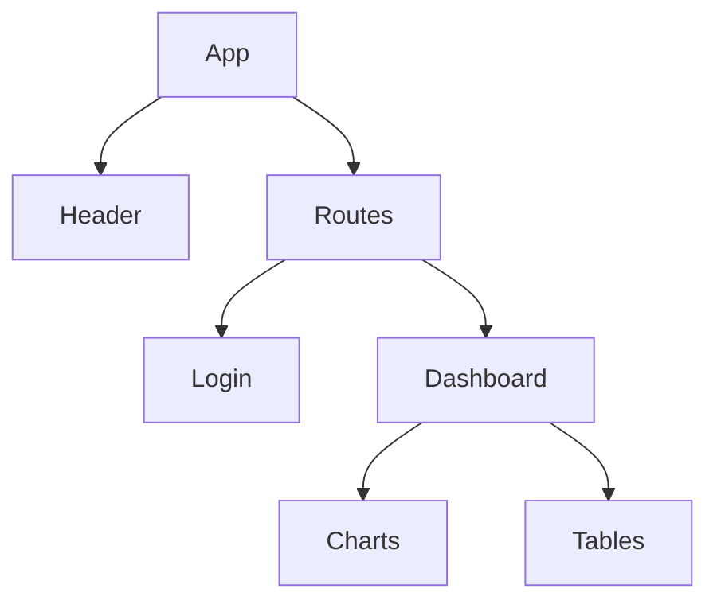
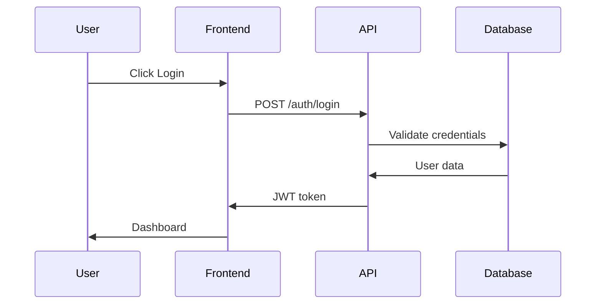
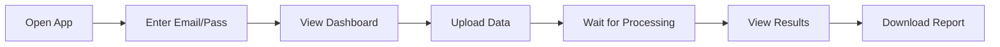

# Human Docs Generator Skill

## Role
Automatically generates and maintains role-specific documentation for humans when significant changes occur in the system.

## Purpose
Transform complex AI state and technical implementations into simple, role-specific guides that humans can actually understand and use.

## Trigger Conditions

### Automatic Triggers
- ✅ Epic completed
- 🔧 Public API modified
- 🎯 New user feature deployed
- 💥 Breaking change introduced
- 🐛 Critical bug fixed
- 📊 5+ related tasks completed

### Manual Trigger
```json
{
  "event": "generate.human.docs",
  "scope": "all|specific-role",
  "reason": "manual request"
}
```

## Document Structure

### Files Maintained
```
ai-state/human-docs/
├── INDEX.md                 # Role directory & quick nav
├── frontend-developer.md    # React, components, routes
├── backend-developer.md     # APIs, models, database
├── architect.md            # System design, patterns
├── devops.md              # Deploy, monitor, debug
├── tester.md              # Test suites, coverage
├── product-manager.md     # Features, metrics, roadmap
└── end-user-guide.md      # Screenshots, how-to-use
```

## Generation Process

### 1. Gather Context
```yaml
sources:
  - ai-state/active/     # Current implementations
  - ai-state/knowledge/  # Patterns and decisions
  - operations.log       # Recent changes
  - test-results/        # What's working
```

### 2. Extract Role-Relevant Info

#### Frontend Developer Needs
- Component locations & hierarchy
- State management patterns
- Reusable components list
- Recent UI changes

#### Backend Developer Needs
- API endpoint documentation
- Database schema changes
- Authentication flow
- Service dependencies

#### End User Needs
- Screenshots with annotations
- Step-by-step guides
- Feature locations
- Common workflows

### 3. Transform to Human Format

#### Rules for Human Docs
1. **Max 1000 words** per document
2. **Diagrams over text** (Mermaid.js)
3. **Examples over explanations**
4. **Current state only** (no history)
5. **Quickstart focused**

### 4. Generate Diagrams

#### Component Tree (Frontend)


#### API Flow (Backend)


#### User Flow (End User)


## Document Templates

### Frontend Developer Template
```markdown
# Frontend Developer Guide

## Quick Start
[3-step setup process]

## Component Map
[Mermaid diagram of components]

## To Add a New Page
1. Create component in `/src/pages/`
2. Add route in `/src/routes.tsx`
3. Update navigation in `/src/components/Nav.tsx`

## Available Components
- `<Button>` - Primary actions
- `<Card>` - Content containers
- `<Table>` - Data display
[List reusable components]

## State Management
[Current state shape diagram]

## Recent Changes
- ✅ Added password reset
- ✅ Updated dashboard layout
```

### End User Template
```markdown
# How to Use [App Name]

## Getting Started
[Screenshot of login page with arrows]

## Main Features

### Upload Data
1. Click "Upload" button (top-right)
2. Select your CSV file
3. Click "Process"
[Screenshot with numbered steps]

### View Reports
[Screenshot of reports page]
- Yellow box = Warnings
- Green box = Success
- Red box = Errors

## Common Tasks
**Q: How do I reset my password?**
A: Click "Forgot Password" on login page

**Q: Where are my old reports?**
A: Click "History" in sidebar
```

## Quality Checks

### Before Publishing
- [ ] Under 1000 words?
- [ ] Has diagrams/screenshots?
- [ ] Includes quickstart?
- [ ] Examples provided?
- [ ] No technical jargon?
- [ ] Tested instructions work?

## Integration

### Input Events
```json
{
  "event": "epic.completed",
  "epic_id": "epic-oauth",
  "tasks_completed": ["task-001", "task-002"],
  "changes": ["Added Google login"]
}
```

### Output Events
```json
{
  "event": "human.docs.updated",
  "files": [
    "frontend-developer.md",
    "end-user-guide.md"
  ],
  "sections_changed": [
    "authentication",
    "login-methods"
  ]
}
```

## Anti-Patterns to Avoid

❌ Writing changelogs (just current state)
❌ Technical deep-dives (keep it simple)
❌ Walls of text (use bullets/diagrams)
❌ Assuming knowledge (explain everything)
❌ Version history (one living document)

## Success Metrics

- Reading time < 5 minutes
- Diagram-to-text ratio > 40%
- Quickstart success rate > 90%
- Human confusion tickets < 5%
- Doc update frequency = feature frequency