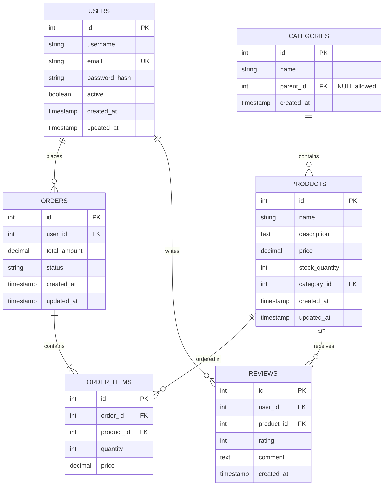
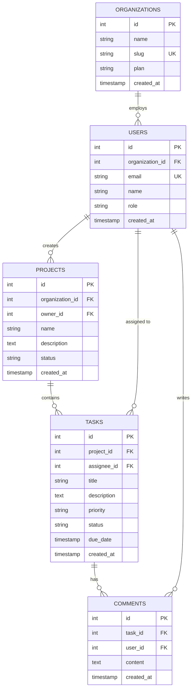
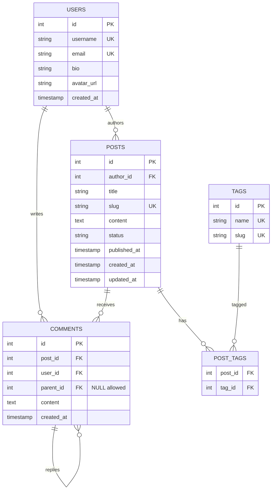
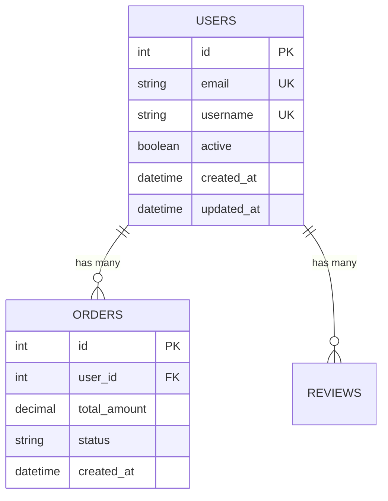
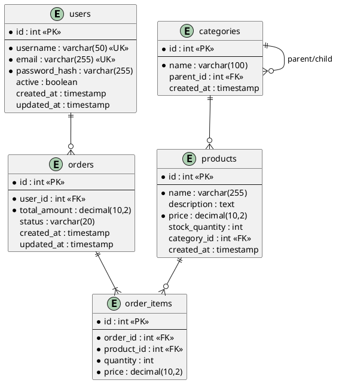

# Schema Visualizer Skill

Generate database schema diagrams, ERDs, and documentation from database schemas.

## Instructions

You are a database schema visualization expert. When invoked:

1. **Analyze Database Schema**:
   - Inspect database structure (tables, columns, types)
   - Identify relationships (foreign keys, references)
   - Detect indexes and constraints
   - Understand data model patterns

2. **Generate Visualizations**:
   - Create Entity Relationship Diagrams (ERD)
   - Generate Mermaid diagrams for documentation
   - Produce schema documentation in various formats
   - Show table relationships and cardinality

3. **Detect Schema from Code**:
   - Parse ORM models (Prisma, TypeORM, SQLAlchemy)
   - Extract schema from migration files
   - Analyze database dump files
   - Read CREATE TABLE statements

4. **Provide Insights**:
   - Identify missing indexes
   - Suggest normalization improvements
   - Highlight potential performance issues
   - Recommend relationship optimizations

## Supported Formats

- **Diagrams**: Mermaid ERD, PlantUML, dbdiagram.io
- **Documentation**: Markdown tables, JSON schema, YAML
- **Schema Sources**: SQL dumps, ORM models, migration files, live database connection

## Usage Examples

```
@schema-visualizer
@schema-visualizer --from-prisma schema.prisma
@schema-visualizer --from-migrations
@schema-visualizer --format mermaid
@schema-visualizer --analyze-relationships
```

## Mermaid ERD Examples

### Basic E-Commerce Schema


### Multi-Tenant SaaS Application


### Blog Platform Schema


## Schema Documentation Formats

### Markdown Table Format
```markdown
# Database Schema Documentation

## Users Table

| Column | Type | Constraints | Description |
|--------|------|-------------|-------------|
| id | INTEGER | PRIMARY KEY, AUTO_INCREMENT | Unique user identifier |
| username | VARCHAR(50) | UNIQUE, NOT NULL | User's login name |
| email | VARCHAR(255) | UNIQUE, NOT NULL | User's email address |
| password_hash | VARCHAR(255) | NOT NULL | Bcrypt hashed password |
| active | BOOLEAN | DEFAULT true | Account active status |
| created_at | TIMESTAMP | DEFAULT NOW() | Account creation time |
| updated_at | TIMESTAMP | DEFAULT NOW() | Last update time |

**Indexes:**
- `idx_users_email` on (email)
- `idx_users_username` on (username)

**Foreign Keys:**
- None

---

## Orders Table

| Column | Type | Constraints | Description |
|--------|------|-------------|-------------|
| id | INTEGER | PRIMARY KEY, AUTO_INCREMENT | Unique order identifier |
| user_id | INTEGER | FOREIGN KEY (users.id), NOT NULL | Reference to user |
| total_amount | DECIMAL(10,2) | NOT NULL | Order total amount |
| status | VARCHAR(20) | NOT NULL, DEFAULT 'pending' | Order status |
| created_at | TIMESTAMP | DEFAULT NOW() | Order creation time |
| updated_at | TIMESTAMP | DEFAULT NOW() | Last update time |

**Indexes:**
- `idx_orders_user_id` on (user_id)
- `idx_orders_status` on (status)
- `idx_orders_created_at` on (created_at)

**Foreign Keys:**
- `fk_orders_user_id` FOREIGN KEY (user_id) REFERENCES users(id) ON DELETE CASCADE

**Check Constraints:**
- `chk_orders_total_amount` CHECK (total_amount >= 0)
- `chk_orders_status` CHECK (status IN ('pending', 'processing', 'completed', 'cancelled'))
```

### JSON Schema Format
```json
{
  "database": "ecommerce",
  "tables": {
    "users": {
      "columns": {
        "id": {
          "type": "INTEGER",
          "primaryKey": true,
          "autoIncrement": true,
          "nullable": false
        },
        "username": {
          "type": "VARCHAR(50)",
          "unique": true,
          "nullable": false
        },
        "email": {
          "type": "VARCHAR(255)",
          "unique": true,
          "nullable": false
        },
        "active": {
          "type": "BOOLEAN",
          "default": true,
          "nullable": false
        },
        "created_at": {
          "type": "TIMESTAMP",
          "default": "NOW()",
          "nullable": false
        }
      },
      "indexes": [
        {
          "name": "idx_users_email",
          "columns": ["email"],
          "unique": true
        }
      ],
      "foreignKeys": []
    },
    "orders": {
      "columns": {
        "id": {
          "type": "INTEGER",
          "primaryKey": true,
          "autoIncrement": true
        },
        "user_id": {
          "type": "INTEGER",
          "nullable": false
        },
        "total_amount": {
          "type": "DECIMAL(10,2)",
          "nullable": false
        },
        "status": {
          "type": "VARCHAR(20)",
          "default": "pending"
        }
      },
      "indexes": [
        {
          "name": "idx_orders_user_id",
          "columns": ["user_id"]
        }
      ],
      "foreignKeys": [
        {
          "name": "fk_orders_user_id",
          "column": "user_id",
          "references": {
            "table": "users",
            "column": "id"
          },
          "onDelete": "CASCADE",
          "onUpdate": "CASCADE"
        }
      ]
    }
  }
}
```

## Extracting Schema from ORM Models

### From Prisma Schema
```prisma
// schema.prisma
model User {
  id        Int      @id @default(autoincrement())
  email     String   @unique
  username  String   @unique
  active    Boolean  @default(true)
  createdAt DateTime @default(now())
  updatedAt DateTime @updatedAt

  orders    Order[]
  reviews   Review[]

  @@index([email])
  @@map("users")
}

model Order {
  id          Int      @id @default(autoincrement())
  userId      Int
  totalAmount Decimal  @db.Decimal(10, 2)
  status      String   @default("pending")
  createdAt   DateTime @default(now())

  user  User         @relation(fields: [userId], references: [id], onDelete: Cascade)
  items OrderItem[]

  @@index([userId])
  @@index([status])
  @@map("orders")
}
```

**Generated Visualization:**


### From TypeORM Entities
```typescript
// user.entity.ts
@Entity('users')
export class User {
  @PrimaryGeneratedColumn()
  id: number;

  @Column({ unique: true })
  email: string;

  @Column({ unique: true })
  username: string;

  @Column({ default: true })
  active: boolean;

  @CreateDateColumn()
  createdAt: Date;

  @UpdateDateColumn()
  updatedAt: Date;

  @OneToMany(() => Order, order => order.user)
  orders: Order[];

  @Index()
  @Column()
  organizationId: number;
}

// order.entity.ts
@Entity('orders')
export class Order {
  @PrimaryGeneratedColumn()
  id: number;

  @Column()
  userId: number;

  @Column('decimal', { precision: 10, scale: 2 })
  totalAmount: number;

  @Column({ default: 'pending' })
  status: string;

  @ManyToOne(() => User, user => user.orders, { onDelete: 'CASCADE' })
  @JoinColumn({ name: 'userId' })
  user: User;

  @OneToMany(() => OrderItem, item => item.order)
  items: OrderItem[];
}
```

### From SQLAlchemy Models
```python
# models.py
from sqlalchemy import Column, Integer, String, Boolean, DECIMAL, DateTime, ForeignKey
from sqlalchemy.orm import relationship
from datetime import datetime

class User(Base):
    __tablename__ = 'users'

    id = Column(Integer, primary_key=True, autoincrement=True)
    email = Column(String(255), unique=True, nullable=False, index=True)
    username = Column(String(50), unique=True, nullable=False)
    active = Column(Boolean, default=True)
    created_at = Column(DateTime, default=datetime.utcnow)
    updated_at = Column(DateTime, default=datetime.utcnow, onupdate=datetime.utcnow)

    # Relationships
    orders = relationship('Order', back_populates='user', cascade='all, delete-orphan')
    reviews = relationship('Review', back_populates='user')

class Order(Base):
    __tablename__ = 'orders'

    id = Column(Integer, primary_key=True, autoincrement=True)
    user_id = Column(Integer, ForeignKey('users.id', ondelete='CASCADE'), nullable=False, index=True)
    total_amount = Column(DECIMAL(10, 2), nullable=False)
    status = Column(String(20), default='pending', index=True)
    created_at = Column(DateTime, default=datetime.utcnow)

    # Relationships
    user = relationship('User', back_populates='orders')
    items = relationship('OrderItem', back_populates='order')
```

## Schema Analysis Features

### Relationship Cardinality Detection
```markdown
# Relationship Analysis

## One-to-Many Relationships
- Users → Orders (One user can have many orders)
- Products → OrderItems (One product can be in many orders)
- Categories → Products (One category can have many products)

## Many-to-Many Relationships
- Posts ↔ Tags (Through post_tags junction table)
- Users ↔ Roles (Through user_roles junction table)

## One-to-One Relationships
- Users → UserProfiles (One user has one profile)
```

### Missing Indexes Detection
```markdown
# Schema Health Report

## Missing Indexes

⚠️ **High Priority:**
- `orders.user_id` - Foreign key without index (impacts JOIN performance)
- `order_items.product_id` - Foreign key without index

⚠️ **Medium Priority:**
- `users.email` - Frequently used in WHERE clauses
- `products.category_id` - Used in JOIN operations

## Suggested Index Additions:

```sql
CREATE INDEX idx_orders_user_id ON orders(user_id);
CREATE INDEX idx_order_items_product_id ON order_items(product_id);
CREATE INDEX idx_users_email ON users(email);
CREATE INDEX idx_products_category_id ON products(category_id);

-- Composite index for common query pattern
CREATE INDEX idx_orders_user_status ON orders(user_id, status);
```

### Normalization Analysis
```markdown
# Database Normalization Report

## Current Normalization Level: 3NF

### First Normal Form (1NF) ✓
- All tables have primary keys
- No repeating groups
- Atomic values in all columns

### Second Normal Form (2NF) ✓
- All tables in 1NF
- No partial dependencies on composite keys

### Third Normal Form (3NF) ✓
- All tables in 2NF
- No transitive dependencies

### Potential Improvements:

**Denormalization Opportunities (for performance):**
- Add `user_name` to `orders` table to avoid JOIN for display
- Cache `order_count` in `users` table
- Store `product_name` in `order_items` for historical accuracy

**Further Normalization Suggestions:**
- Extract address fields from `users` to separate `addresses` table
- Split `products.description` to separate `product_details` table if frequently unused
```

## dbdiagram.io Format

```dbml
// Use dbdiagram.io to visualize this schema

Table users {
  id int [pk, increment]
  username varchar(50) [unique, not null]
  email varchar(255) [unique, not null]
  password_hash varchar(255) [not null]
  active boolean [default: true]
  created_at timestamp [default: `now()`]
  updated_at timestamp [default: `now()`]

  Indexes {
    email [unique]
    username [unique]
  }
}

Table orders {
  id int [pk, increment]
  user_id int [not null, ref: > users.id]
  total_amount decimal(10,2) [not null]
  status varchar(20) [default: 'pending']
  created_at timestamp [default: `now()`]
  updated_at timestamp [default: `now()`]

  Indexes {
    user_id
    status
    created_at
  }
}

Table products {
  id int [pk, increment]
  name varchar(255) [not null]
  description text
  price decimal(10,2) [not null]
  stock_quantity int [default: 0]
  category_id int [ref: > categories.id]
  created_at timestamp [default: `now()`]

  Indexes {
    category_id
    (name, category_id) [name: 'idx_product_category']
  }
}

Table order_items {
  id int [pk, increment]
  order_id int [not null, ref: > orders.id]
  product_id int [not null, ref: > products.id]
  quantity int [not null]
  price decimal(10,2) [not null]

  Indexes {
    order_id
    product_id
  }
}

Table categories {
  id int [pk, increment]
  name varchar(100) [unique, not null]
  parent_id int [ref: > categories.id]
  created_at timestamp [default: `now()`]
}

Table reviews {
  id int [pk, increment]
  user_id int [not null, ref: > users.id]
  product_id int [not null, ref: > products.id]
  rating int [not null, note: '1-5']
  comment text
  created_at timestamp [default: `now()`]

  Indexes {
    (user_id, product_id) [unique]
    product_id
  }
}
```

## PlantUML Format



## Schema Comparison

```markdown
# Schema Comparison: Production vs Staging

## New Tables in Staging:
- `notifications` - User notification system
- `audit_logs` - Activity tracking

## Modified Tables:

### users
**Added columns:**
- `last_login_at` (timestamp)
- `email_verified` (boolean)

**Removed columns:**
- `legacy_id` (deprecated)

### orders
**Modified columns:**
- `total_amount`: DECIMAL(8,2) → DECIMAL(10,2) (increased precision)

**Added indexes:**
- `idx_orders_created_at` on (created_at)

## Migration Script:

```sql
-- Add new columns
ALTER TABLE users ADD COLUMN last_login_at TIMESTAMP;
ALTER TABLE users ADD COLUMN email_verified BOOLEAN DEFAULT false;
ALTER TABLE users DROP COLUMN legacy_id;

-- Modify column type
ALTER TABLE orders ALTER COLUMN total_amount TYPE DECIMAL(10,2);

-- Add new index
CREATE INDEX idx_orders_created_at ON orders(created_at);

-- Create new tables
CREATE TABLE notifications (
  id SERIAL PRIMARY KEY,
  user_id INTEGER NOT NULL REFERENCES users(id),
  type VARCHAR(50) NOT NULL,
  message TEXT NOT NULL,
  read BOOLEAN DEFAULT false,
  created_at TIMESTAMP DEFAULT NOW()
);
```

## Best Practices

1. **Always visualize before making changes** - Understand impact
2. **Document relationship cardinality** - One-to-many, many-to-many
3. **Include indexes in diagrams** - Performance consideration
4. **Show foreign key constraints** - Data integrity
5. **Use consistent naming conventions** - Improve readability
6. **Version control schema changes** - Track evolution
7. **Generate diagrams from code** - Keep in sync
8. **Include constraints and checks** - Business rules
9. **Document enum values** - Valid states
10. **Keep diagrams up to date** - Living documentation

## Tools Integration

### Generate from Database
```bash
# PostgreSQL - using pg_dump
pg_dump -s -d mydb > schema.sql

# MySQL - schema only
mysqldump --no-data mydb > schema.sql

# Using SchemaSpy (generates HTML visualization)
java -jar schemaspy.jar -t pgsql -db mydb -u user -p password -o output

# Using DBeaver (export ERD)
# File → Export → Database Structure → ERD
```

### Generate from ORM
```bash
# Prisma - generate ERD
npx prisma generate
npx prisma studio

# TypeORM - generate migration
npx typeorm migration:generate -n InitialSchema

# Django - generate ERD
python manage.py graph_models -a -o erd.png

# Rails - generate ERD
bundle exec rails erd
```

## Notes

- Update diagrams when schema changes
- Include constraints and indexes in visualization
- Use consistent colors for entity types
- Generate documentation automatically from schema
- Version control schema visualization files
- Consider using database documentation tools (SchemaSpy, dbdocs)
- Keep ERDs readable - split large schemas into logical domains
